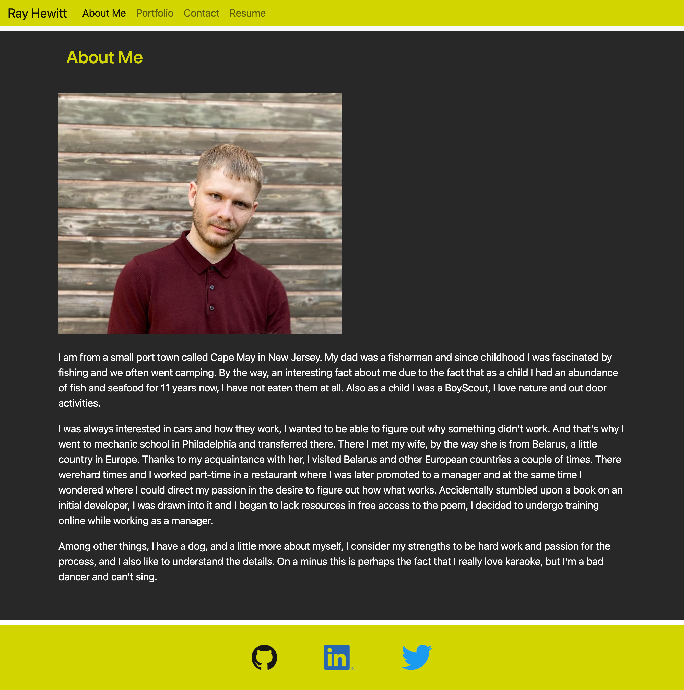

# Portfolio

## Description

This is a portfolio I have built in order to try to get a job.Completely built using React this is one of my favorite projects to work on. leveraging Bootstrap this site is mobile responsive and able to be viewed on any device with ease 

## Installation
 No Installation nessasary go to https://rayman244.github.io/portfolio4/

## Usage

## Credits
Penn University Bootcamp

## License
MIT License

Copyright (c) 2022 Ray Hewitt

Permission is hereby granted, free of charge, to any person obtaining a copy
of this software and associated documentation files (the "Software"), to deal
in the Software without restriction, including without limitation the rights
to use, copy, modify, merge, publish, distribute, sublicense, and/or sell
copies of the Software, and to permit persons to whom the Software is
furnished to do so, subject to the following conditions:

The above copyright notice and this permission notice shall be included in all
copies or substantial portions of the Software.

THE SOFTWARE IS PROVIDED "AS IS", WITHOUT WARRANTY OF ANY KIND, EXPRESS OR
IMPLIED, INCLUDING BUT NOT LIMITED TO THE WARRANTIES OF MERCHANTABILITY,
FITNESS FOR A PARTICULAR PURPOSE AND NONINFRINGEMENT. IN NO EVENT SHALL THE
AUTHORS OR COPYRIGHT HOLDERS BE LIABLE FOR ANY CLAIM, DAMAGES OR OTHER
LIABILITY, WHETHER IN AN ACTION OF CONTRACT, TORT OR OTHERWISE, ARISING FROM,
OUT OF OR IN CONNECTION WITH THE SOFTWARE OR THE USE OR OTHER DEALINGS IN THE
SOFTWARE.

---

## Badges

## Features

- Send me an email
- Text/Call me 
- Mobile Responsive 

## How to Contribute
https://github.com/Rayman244/portfolio4

If you aren't satisfied with the build tool and configuration choices, you can `eject` at any time. This command will remove the single build dependency from your project.

## Tests
 No errors to report

 ## Questions
 message me on Github https://github.com/Rayman244/
 email me at [rayhewitt42@icloud.com](mailto:rayhewitt42@icloud.com)